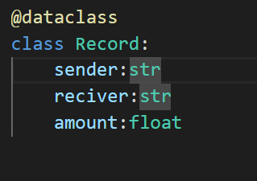
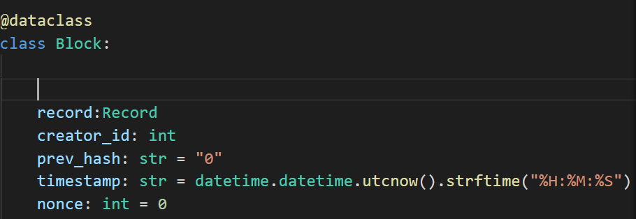
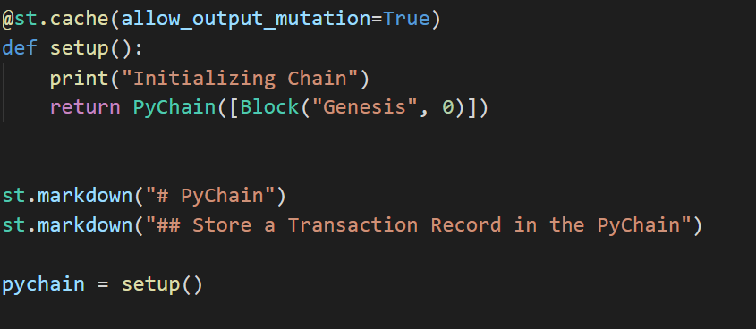
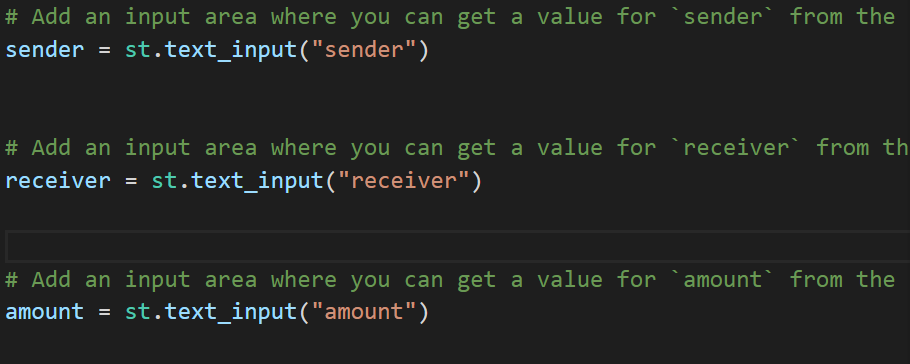
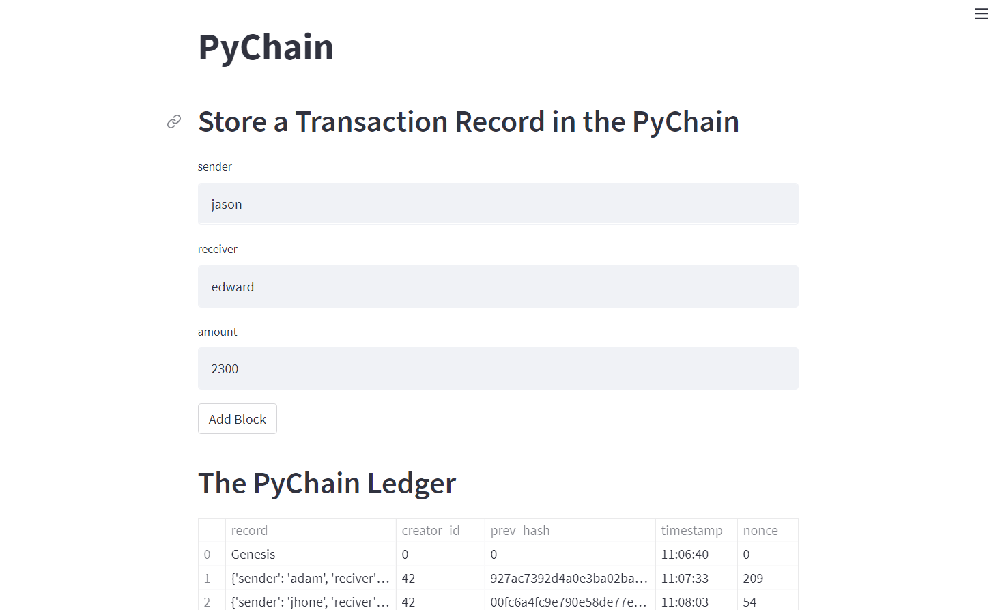
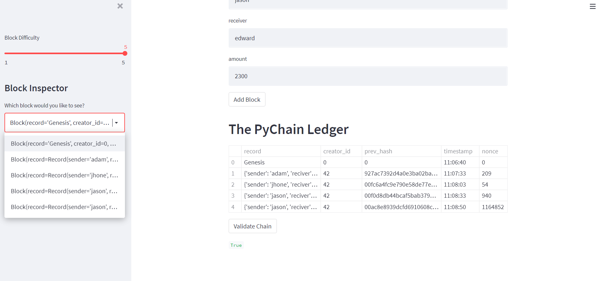

# PyChain-Ledger

### Done by Nedal Mahaweh 
### In this Assignemnt we will built blockchain-based ledger system and complete a user-friendly web interface using ` Streamlit ` 

## Files
* Pychain-Ledger 
* Images 

### Step 1: Create a Record Data Class

Define a new Python data class named `Record`. Give this new class a formalized data structure that consists of the `sender`, `receiver`, and `amount` attributes 

### Step 2:  Create a Block Data Class

#### Add the cache decorator for Streamlit

### Step 3: Add Relevant User Inputs to the Streamlit Interface

Code additional input areas for the user interface of the Streamlit application. Create these input areas to capture the sender, receiver, and amount for each transaction that will be  stored in the `Block` record

### Step 4: Test the PyChain Ledger by Storing Records and showing the Result 

 | 

